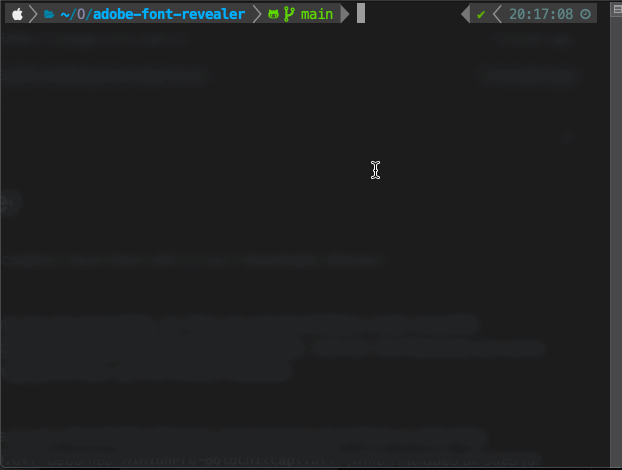

# ⚜️ Adobe Fonts Revealer

#  

> Copy Adobe Fonts (OTF) to your Downloads directory

**Problem**  
Your licensed and activated Adobe Fonts are not accessible. (1) They are stored (hidden) under (macOS): `$HOME/Library/Application\ Support/Adobe/CoreSync/plugins/livetype/.r/`. And (2), the filenames are some sort of id, which is good for Adobe managing the files, yet not human-readable.

**Solution**  
This script **copies all activated font files to your Downloads directory** and renames all of them to what they represent.
For example, the file `.17969.otf` becomes `MinionPro-BoldCnItCapt.otf` (which includes all cues for font varition, weight, etc.).

## Demo

  

## Execution
You need to have `lcdf-typetools`[1] installed (< 1mb). If you have `texlive` installed, you might already have that tool available.

1. Install `lcdf-typetools`
- macOS (brew):
  - `brew install lcdf-typetools`
- Windows (WSL, to do)
  - `sudo apt-get install -y lcdf-typetools`

2. Run `sh reveal` in your Terminal

[1] [lcdf-typetools](https://github.com/kohler/lcdf-typetools) by [Eddie Kohler](https://github.com/kohler)
